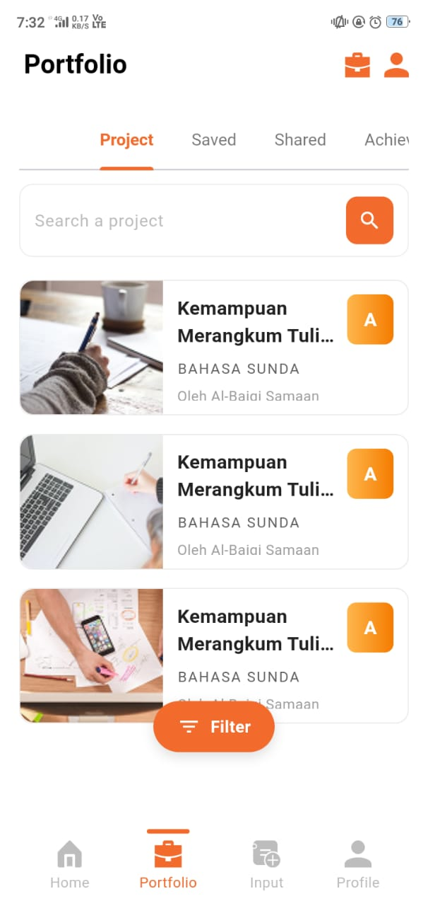
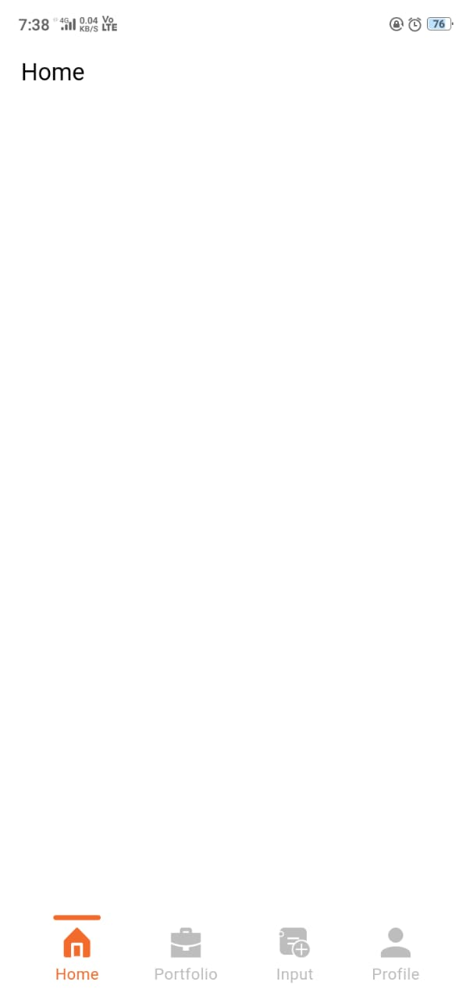

# Yoliday Assignment

A Flutter application developed as part of an assignment task.  
This project demonstrates clean UI development, state management, and component structuring using Flutter.

---

## 🚀 Getting Started

This project serves as a starting point for building a Flutter application.

### 📌 Prerequisites
Make sure you have the following installed:
- Flutter SDK  
- Android Studio / VS Code  
- Dart SDK  

---

## 📸 App Screenshots

> Replace the image paths below with your actual screenshot file names.

| Screenshot 1 | Screenshot 2 |
|-------------|--------------|
|  |  |

---

## 📚 Resources

Helpful documentation if you're new to Flutter:

- [Write your first Flutter app](https://docs.flutter.dev/get-started/codelab)
- [Flutter Cookbook](https://docs.flutter.dev/cookbook)

For more detailed Flutter documentation, refer to:
- [Flutter Official Documentation](https://docs.flutter.dev/)  
This includes tutorials, samples, UI guidelines, and full API references.

---

## 🛠️ How to Run the Project

```bash
flutter pub get
flutter run
